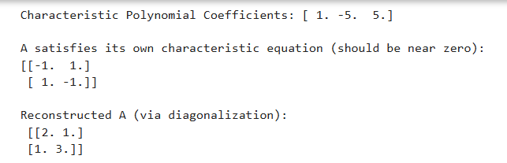
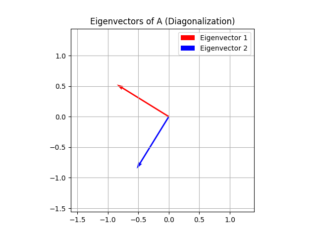
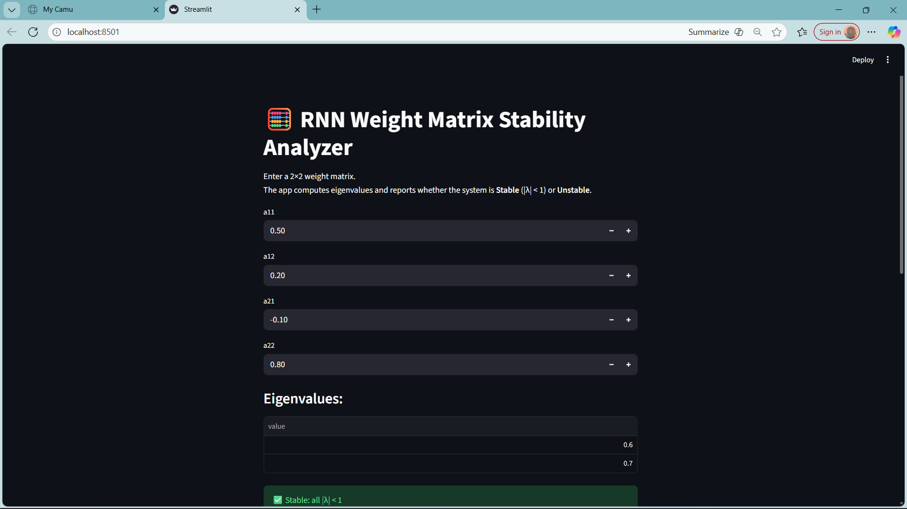
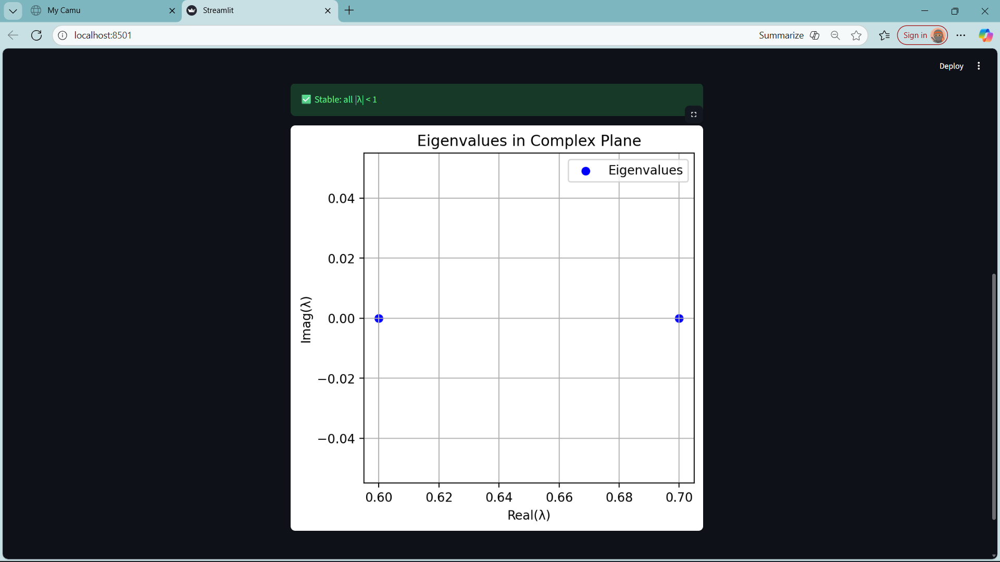

# 🎓 Math for AI Integrations  
## 02 — Cayley–Hamilton Theorem, Diagonalization & RNN Stability  

---

### 🧠 Concept  
Every square matrix satisfies its own characteristic equation (Cayley–Hamilton theorem).  
Diagonalization expresses a matrix as \( A = P D P^{-1} \), simplifying power computations and stability analysis.  
Eigenvalues reveal how transformations scale space — and, in ML, how **RNN weights** affect stability.

---

### 📘 Notes / What I Learned  
- Verified the **Cayley–Hamilton theorem** using Python.  
- Understood diagonalization and how it reconstructs a matrix via \( P D P^{-1} \).  
- Connected eigenvalues to **stability** in ML (e.g., exploding/vanishing gradients).  
- Explored eigenvalue plots for geometric and numerical intuition.

---

### 📚 Where I Learned  
- Concept Explanation: [3Blue1Brown — Essence of Linear Algebra, Chapter 15](https://www.youtube.com/watch?v=cdZnhQjJu4I)  
- Theorem and Proof: [Steve brunton— Cayley–Hamilton Theorem](https://www.youtube.com/watch?v=PrfxmkBsYKE)  
- Diagnolisation: [Prime newtons](https://www.youtube.com/watch?v=uHW2zThZDEw)
- Code guidance — ChatGPT  
- Hands-on coding — VS Code + Streamlit  

---

### 🧩 Files  
- `cayley_hamilton.py` — verifies Cayley–Hamilton theorem and visualizes eigenvectors.  
- `stability_analyzer.py` — Streamlit app for RNN weight matrix stability.  
- Folder `outputs/` — stores plots and screenshots.

---

### ⚙️ How to Run  
1. `python cayley_hamilton.py` (requires NumPy, Matplotlib)  
2. `streamlit run stability_analyzer.py` (requires Streamlit, NumPy, Matplotlib)

---

### 🖼️ Outputs
- Caley_hamilton.py

- stability_analzer.py

